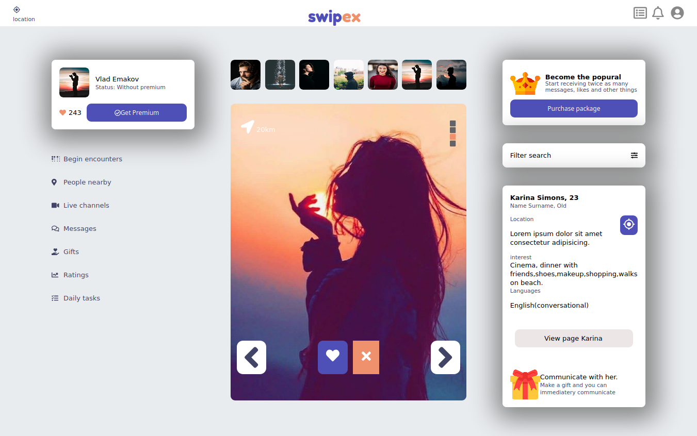
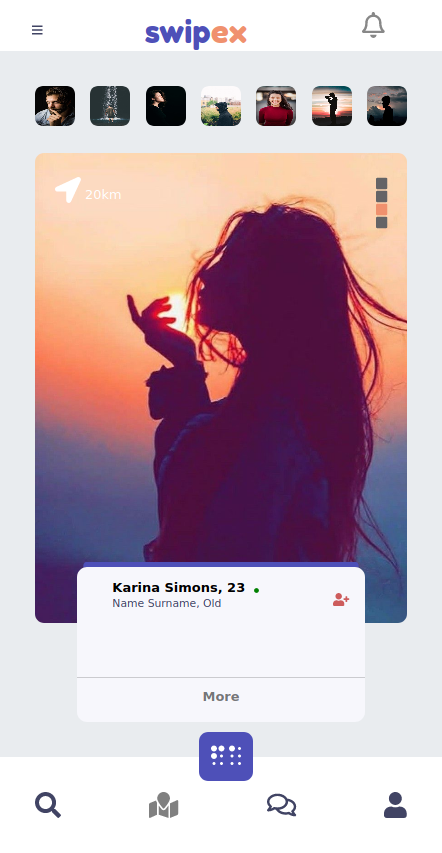
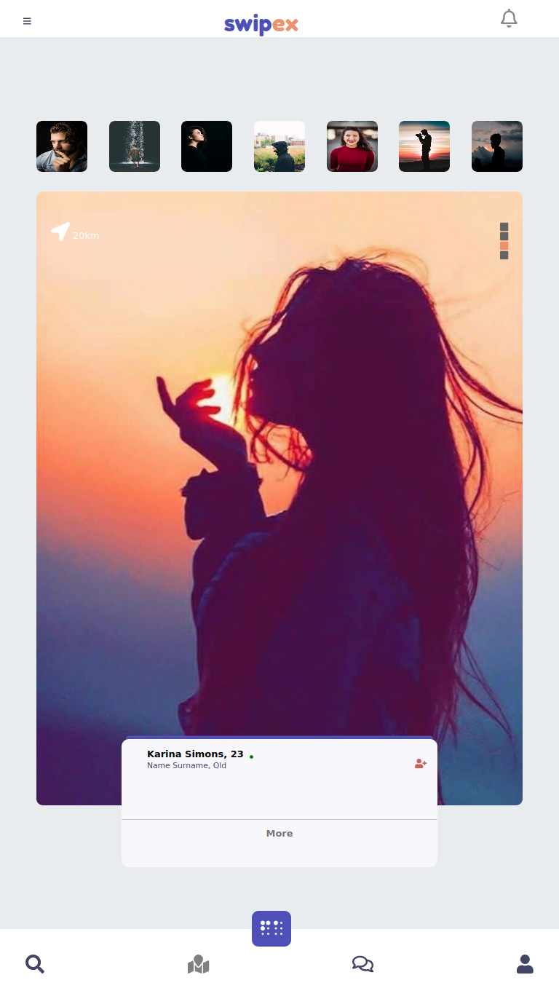

# Capstone

> This project is from [Microverse](https://www.microverse.org/) main curriculum, the Capstone [click here](https://www.notion.so/microverse/HTML-CSS-capstone-project-Social-network-5f1311dcf3734d71ac98198dff5254c2).

## Screenshots

### User page

#### Laptop and Desktops screen
;

#### Mobile screens
;

#### Tablets screens
;

### Chat page

#### Laptop and Desktops screen
;

#### Mobile screens
;

#### Tablets screens
;

## Built With and tools used

- [HTML](https://developer.mozilla.org/en-US/docs/Web/HTML),
- [CSS](https://www.w3schools.com/css/),
- [Fontawesome](https://fontawesome.com/)
- [Node](https://nodejs.org/en/)
- [Material icons](https://material.io/resources/icons/)

## Live Demo

[Live Demo Link](https://muhenge.github.io/capstone/)

## Getting Started

-Use `git clone https://github.com/muhenge/capstone.git` 

### Setup
Use `npm install` to set up and install all packages(fontawesome) locally

## Authors

👤 **Author**

- Github: [Herve](https://github.com/muhenge)

## 🤝 Contributing

Contributions, issues and feature requests are welcome!

Feel free to check the [issues page](https://github.com/muhenge/capstone/issues).

Feel free to clone
